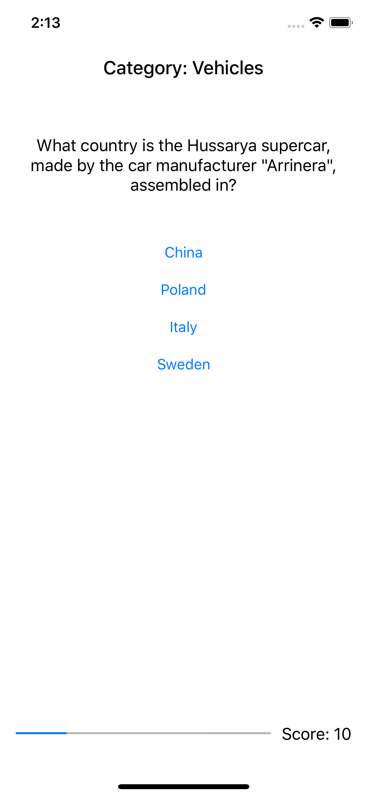

# Trivia Quiz
## Initial and Updated Features
### -Added a home screen where the user can choose a category and question type
### -Added icons in the tab bar
### -Added a question view
### -Added a tab bar so the user also can see the scores
### -Added a label with teh category
### -Added a progress view bar
### -Added a score label
### -Added a result page
### -Added the functionality to add your result to the score list
### -Added the functionality to see the high scores
### -Added the functionality to start a new game from the result page
### -Added the functionality to start a new games from the high scores list
### -Added the constraint that the new game button in the high scores list can only be clicked if it is not via the tab bar

### Home
<kbd></kbd>

### In Game
<kbd></kbd>

### Result Page before submit
<kbd></kbd>

### Result Page
<kbd></kbd>

### High Scores via Results
<kbd></kbd>

### High Scores via Tab Bar
<kbd></kbd>

